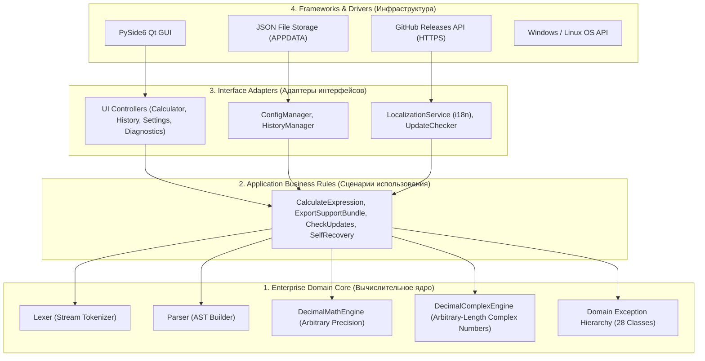
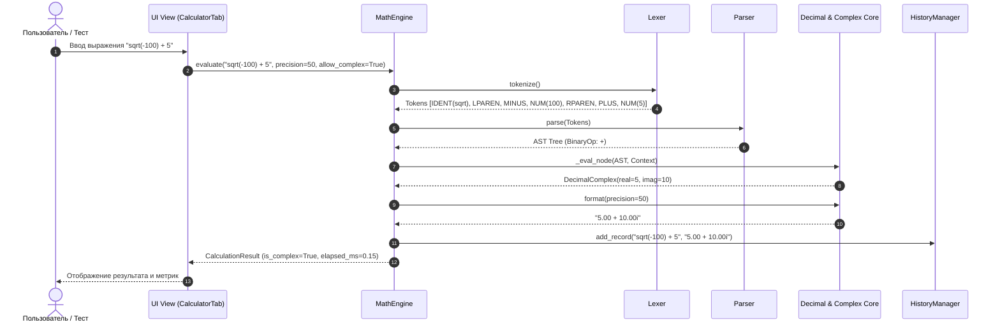

# Техническая документация архитектуры (System Architecture Document)
## Проект: SQRT_Gem (High-Precision Analytical Math Engine)

> **Document Status:** Approved / Production-Ready  
> **Engineering Standard:** Google Technical Documentation Style  
> **Architecture Pattern:** Clean Architecture (Hexagonal / Ports & Adapters)  
> **Target Lifecycle:** 10-Year Long-Term Support (LTS: 2026–2036)  

---

## 1. Обзор системы (System Overview)

### 1.1. Назначение и масштаб
**SQRT_Gem** — настольная кроссплатформенная вычислительная система высокой точности, спроектированная для прецизионных аналитических расчетов в диапазоне от 0 до 2000 знаков после запятой с поддержкой сверхдлинных операндов (1000+ десятичных разрядов), действительных и комплексных чисел.

Система устраняет фундаментальные ограничения машинного представления чисел с плавающей точкой стандарта IEEE 754 (`float64`, `double`), гарантируя математическую детерминированность вычислений.

### 1.2. Архитектурные принципы
1. **Независимость от фреймворков (Framework Independence):** Вычислительное ядро полностью изолировано от PySide6/Qt и внешних сторонних библиотек.
2. **Тестируемость (Testability):** Бизнес-правила верифицируются без запуска GUI, виртуального X-сервера или сетевых интерфейсов.
3. **Независимость от пользовательского интерфейса (UI Independence):** GUI может быть заменен на Web, CLI или RPC-сервис без модификации доменных сущностей.
4. **Отказоустойчивость и безопасность (Reliability & Security):** Нулевое использование `eval()` / `exec()`, строгий синтаксический анализ на базе AST, атомарный ввод-вывод.

---

## 2. Архитектурные уровни (Clean Architecture Layers)

### 2.1. Уровень 1: Enterprise Domain Core (Вычислительное ядро)
- **`Lexer`:** Потоковый детерминированный токенизатор строки на базе алгоритма конечного автомата. Формирует токены `Token(type, value, position)`.
- **`Parser`:** Синтаксический анализатор на базе алгоритма рекурсивного спуска / Shunting-Yard. Формирует строго типизированное дерево синтаксического анализа (AST):
  - `NumberNode`, `ConstantNode` (`pi`, `e`, `i`), `UnaryOpNode`, `BinaryOpNode`, `FunctionCallNode` (`sqrt`, `abs`, `ln`, `exp`).
- **`DecimalMath`:** Высокоточная математическая библиотека на базе встроенного C-модуля `_decimal` с контекстом `ROUND_HALF_UP` и защитными разрядами (`Guard Digits = 10`).
- **`DecimalComplex`:** Подсистема комплексных чисел произвольной длины $z = a + bi$ ($a, b \in \text{Decimal}$). Реализует прецизионные операции:
  $$z_1 \pm z_2, \quad z_1 \cdot z_2, \quad \frac{z_1}{z_2}, \quad z^n, \quad |z|, \quad \sqrt{z}$$
  При $\text{Re}(z) < 0$ извлечение корня $\sqrt{-x}$ переводит вычисления в мнимую плоскость: $\sqrt{-x} = i\sqrt{x}$.
- **`Domain Exceptions`:** 28 строгих классов исключений с позиционированием символа сбоя.

### 2.2. Уровень 2: Use Cases (Прикладные сценарии)
- **`EvaluateExpressionUseCase`:** Оркестрация токенизации, синтаксического разбора, вычисления и форматирования с автоопределением комплексного контекста при наличии единицы $i$.
- **`ManageStorageUseCase`:** Атомарное сохранение и восстановление конфигурации и истории.
- **`DiagnosticsWorkflowUseCase`:** Сбор системных метрик, стресс-бенчмарк ядра, генерация архива `support_bundle.zip`.
- **`UpdatePipelineUseCase`:** Проверка обновлений, скачивание манифеста, валидация контрольной суммы SHA-256.

### 2.3. Уровень 3: Interface Adapters
- **`LocalizationService`:** Загрузчик локалей (`ru.json`, `en.json`, `es.json`, `zh.json`) с мгновенным переключением без перезапуска приложения и fallback на `en`.
- **`ConfigManager` / `HistoryManager`:** Репозитории с поддержкой Self-Recovery (автоматическое создание дефолтного конфига при повреждении JSON).

### 2.4. Уровень 4: Frameworks & Drivers
- **PySide6 (Qt 6):** Асинхронный графический интерфейс без блокировки главного потока.
- **Инсталляционные драйверы:** Нативный 64-битный WiX Toolset MSI (Windows) и Debian `dpkg` package (Linux).

---

## 3. Схемы потоков данных (Data Flow Architecture)

### 3.1. Поток вычисления аналитического выражения

---

## 4. Архитектура долговременной поддержки на 10 лет (10-Year LTS Architecture)

Для обеспечения непрерывного функционирования и сопровождения MVP в течение 10 лет (2026–2036) архитектура реализует следующие инженерные решения:

1. **Технологический фундамент с длительным EOL:**
   - Базовый рантайм: Python 3.11 / 3.12 / 3.14 (стандартная библиотека без компилируемых бинарных сторонних математических пакетов вроде SciPy/NumPy).
   - GUI: PySide6 (официальная поддержка Qt 6 LTS до 2030+ года с прозрачной миграцией).
2. **Контейнеризация и воспроизводимость сборки:**
   - GitHub Actions CI/CD матрица тестирования под Ubuntu LTS и Windows Server.
   - Фиксация контрольных сумм и автономные сборщики дистрибутивов (WiX Toolset v3.11/v4 и кроссплатформенный `build_deb.py`).
3. **Бесшовное обновление и вывод из эксплуатации (EOS Policy):**
   - Встроенный Updater с криптографической проверкой SHA-256 исключает поставку несовместимых или поврежденных версий.
   - Полное и чистое удаление (Section 10 ТЗ): пользовательский выбор очистки `%APPDATA%\SQRT_Gem` предотвращает накопление системного мусора на хост-машинах за 10 лет эксплуатации.
