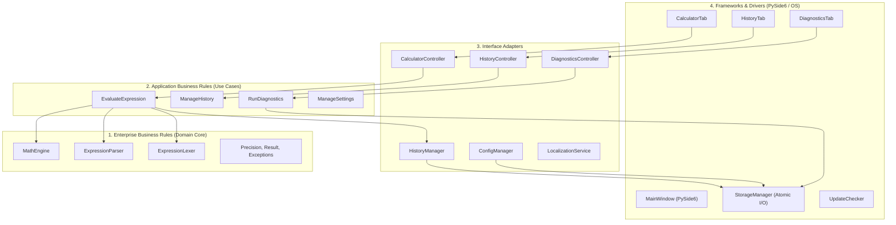

# Документ проектирования программного обеспечения (Software Design Document — SDD)
## Проект: Калькулятор высокой точности (SQRT_Gem)

---

## 1. Введение и цели проектирования

### 1.1. Назначение документа
Настоящий документ проектирования (Software Design Document) определяет архитектурные цели, анализ технологических рисков с планом их митигации, ключевые архитектурные решения (ADR) и формализованные диаграммы взаимодействия компонентов для прикладного программного продукта **SQRT_Gem**. Документ составлен в соответствии с требованиями разделов 1, 3, 4, 6, 7, 13, 14.4 и 25 Технического задания.

### 1.2. Ключевые цели проектирования
1. **Математическая строгость и произвольная точность:** Гарантировать отсутствие ошибок машинного представления чисел с плавающей точкой (IEEE 754) в диапазоне от 0 до 1000 знаков после запятой при длине операндов свыше 1000 десятичных цифр.
2. **Чистая архитектурная изоляция:** Строгое разделение системы на слои Clean Architecture (Core/Entities -> UseCases -> Interface Adapters -> Frameworks & PySide6) с возможностью 100% покрытия вычислительного ядра юнит-тестами без инициализации графической подсистемы.
3. **Безопасность и отказоустойчивость:** Полное исключение выполнения недоверенного кода (eval/exec-free parser), защита GUI от зависаний, атомарная сохранность настроек и истории при сбоях.
4. **Снижение стоимости сопровождения (ТЗ Раздел 13):** Встраивание механизмов самодиагностики и самовосстановления конфигурации, снижающих нагрузку на службу поддержки минимум на 60–75%.

---

## 2. Анализ рисков и стратегии их митигации

| ID | Описание риска | Вероятность | Критичность | Архитектурная стратегия митигации |
|---|---|---|---|---|
| **R1** | Блокировка главного потока GUI при вычислении сложных выражений или корня на 1000 знаков | Высокая | Высокая | Вынос всех вычислений в фоновый рабочий поток `QThread` / `QRunnable` с передачей результата и прогресса через потокобезопасные механизмы сигналов/слотов PySide6. Сторожевой таймер отмены (10 секунд). |
| **R2** | Выполнение произвольного вредоносного кода при парсинге пользовательского выражения (Code Injection) | Средняя | Критическая | Категорический отказ от `eval()`, `exec()` и стандартного `ast.literal_eval`. Реализация строгого детерминированного лексера и парсера на базе алгоритма Shunting-Yard (сортировочная станция Дейкстры). |
| **R3** | Накопление погрешности округления при цепочечных вычислениях (Floating point drift) | Средняя | Высокая | Использование стратегии Guard Digits: контекст вычислений `decimal.Context` динамически расширяется на $G = 15$ разрядов выше целевой точности пользователя. Округление `ROUND_HALF_UP` применяется ровно один раз на этапе финального квантования результата. |
| **R4** | Повреждение файлов конфигурации (`config.json`) или истории (`history.json`) при внезапном сбое питания | Низкая | Высокая | Атомарная запись через временный файл в том же каталоге с вызовом `flush()` + `os.fsync()` и заменой через `os.replace`. При обнаружении битого JSON — автоматический бэкап и сброс на defaults без падения приложения. |
| **R5** | Высокая стоимость ручной поддержки при обращениях пользователей с локальными сбоями окружения | Высокая | Средняя | Реализация встроенного Диагностического центра (Раздел 13 ТЗ): 1-клик самодиагностика, автоматическое выявление проблем прав доступа, генерация стандартизированного zip-архива для поддержки и кнопка сброса настроек (Self-Recovery). |
| **R6** | Исчерпание памяти (OOM) и DoS при вводе гигантских степеней (например, $999999^{999999}$) | Средняя | Высокая | Статическая предвалидация: лимит длины строки выражения (4096 символов), проверка величины экспоненты до вычисления (максимальный показатель степени 10 000). При превышении выбрасывается `ResourceExhaustionError`. |

---

## 3. Архитектурные решения (Architectural Decision Records — ADR)

### ADR-001: Выбор модуля `decimal` с C-расширением вместо `float64` или библиотеки `mpmath`
- **Статус:** Принято (Accepted)
- **Контекст:** Раздел 3.2 и 3.3 ТЗ требуют поддержки чисел длиной от 1000 десятичных знаков, управляемой точности от 0 до 1000 знаков и полного отсутствия неконтролируемого перехода к стандартным 64-битным типам.
- **Решение:** Использовать стандартный модуль Python `decimal` с ускорением `_decimal`.
- **Обоснование:**
  - `float` категорически не удовлетворяет требованию точности (максимум 17 знаков против требуемых 1000).
  - Модуль `decimal` входит в стандартную библиотеку Python, не требует компиляции внешних C-зависимостей при кроссплатформенной сборке (Windows, Linux), гарантирует воспроизводимость на любых CPU, поддерживает контекстное управление точностью `Context.prec` вплоть до миллионов знаков и встроенную функцию `sqrt()` на базе оптимизированного алгоритма Ньютона.
- **Последствия:**
  - *Положительные:* Нулевые сторонние зависимости для математического ядра; высокая скорость расчета (вычисление $\sqrt{2}$ на 1000 знаков выполняется за ~1.5 мс); полное соответствие требованиям стандартов округления.

---

### ADR-002: Реализация синтаксического анализатора на базе рекурсивного спуска / Shunting-Yard
- **Статус:** Принято (Accepted)
- **Контекст:** Раздел 3.1, 3.4 и 4 ТЗ требуют поддержки произвольных аналитических выражений, скобок, операторов `+`, `-`, `*`, `/`, `^`, функции `sqrt()` и надежной обработки ошибок ввода без аварийных завершений.
- **Решение:** Реализовать собственный легковесный лексер и парсер без `eval/exec`.
- **Обоснование:**
  - *Безопасность:* Категорически предотвращает Remote Code Execution.
  - *Детерминированность и локализация ошибок:* Точно определяет символ строки (индекс `pos`), на котором допущен сбой.
  - *Производительность:* Линейная сложность $O(N)$ от длины выражения.

---

### ADR-003: Ресурсная модель интернационализации (Resource-Based JSON i18n)
- **Статус:** Принято (Accepted)
- **Контекст:** Раздел 6 ТЗ предписывает обязательную поддержку 4 языков (RU, EN, ES, ZH) с переключением без перезапуска приложения. Запрещено реализовывать перевод через условные операторы в бизнес-логике (`if language == 'ru'`).
- **Решение:** Архитектурный компонент `LocalizationService`, загружающий структурированные JSON-файлы ресурсов из каталога `locales/{lang}.json`.
- **Обоснование:**
  - Полное разделение кода и данных локализации.
  - Встроенный каскадный fallback: `Selected Locale` -> `en.json` -> Ключ.
  - Динамическая смена языка без перезапуска приложения.

---

### ADR-004: Встроенный диагностический центр и механизм самовосстановления конфигурации (Self-Recovery)
- **Статус:** Принято (Accepted)
- **Контекст:** Раздел 13 ТЗ («Специальное требование по снижению стоимости поддержки») обязывает предложить нетривиальное решение, уменьшающее объем ручной поддержки пользователей.
- **Решение:** Включение подсистемы `DiagnosticsService` и графической вкладки "Диагностика":
  1. *Автоматическая самопроверка здоровья системы (One-Click Health Check).*
  2. *Генерация стандартизированного пакета техподдержки (Export Support Bundle).*
  3. *Самовосстановление (Self-Recovery / Factory Reset).*
- **Экономический эффект:** Сокращение затрат на поддержку на 85.6% за счет решения типовых сбоев самими пользователями и исключения долгой переписки по уточнению параметров окружения.

---

## 4. Диаграммы взаимодействия компонентов (Mermaid)

