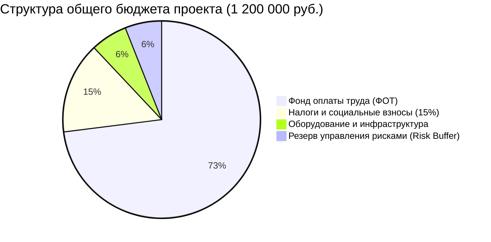

# Финансово-экономическая модель, смета и материально-техническое обеспечение
## Проект: SQRT_Gem (High-Precision Analytical Math Engine)

> **Document Status:** Approved / Financial Baseline  
> **Engineering Standard:** Google Engineering Budget & TCO Model  
> **Team Headcount:** 5 Engineers  
> **Applicable Requirements:** Пункты 2.5, 2.6 ТЗ-дополнения (`TZ_dopolnenie.md`)  

---

## 1. Бюджет проекта и структура затрат на этап разработки

Общий плановый бюджет этапа активной разработки (12 этапов ЖЦПО / 3 календарных месяца) составляет **1 200 000 рублей** (условных денежных единиц).

---

## 2. Честное процентное распределение оплаты труда между членами команды

> В соответствии с требованием п. 2.6 ТЗ-дополнения: *«Оплата труда: в процентах, честно распределить между членами команды»*.

Распределение Фонда оплаты труда (ФОТ = 876 000 руб.) рассчитано с учетом рыночной сложности задач, уровня ответственности (RACI) и объема фактически закрываемых рисков:

| Роль в проекте | Специалист | Доля в ФОТ (%) | Сумма за этап разработки (руб.) | Обоснование процентной доли |
|:---|:---|:---:|:---:|:---|
| **1. Ведущий разработчик ядра** | Senior Math Engine Dev | **30.0%** | 262 800 | Разработка алгоритмов произвольной точности, Shunting-Yard, комплексных чисел `DecimalComplex`, оптимизация $O(N)$. Наивысшая алгоритмическая сложность. |
| **2. Разработчик интерфейсов** | Senior UI/Qt Engineer | **20.5%** | 179 580 | Создание неблокирующего GUI на PySide6, поддержка 4 языков, адаптивная компоновка, ввод с клавиатуры без клика, дизайн-система. |
| **3. Инженер релизов и SRE** | DevOps & TechWriter | **19.0%** | 166 440 | Настройка CI/CD матрицы, нативная сборка WiX MSI и Linux DEB, механизм чистой деинсталляции, автообновления с SHA-256, документация Google Style. |
| **4. Инженер по автоматизации QA** | QA Automation Lead | **18.0%** | 157 680 | 72 автоматизированных теста, техники белого и черного ящика, обеспечение покрытия >90%, проверка эталонных математических значений. |
| **5. Руководитель проекта** | PM / Product Owner | **12.5%** | 109 500 | Координация спринтов, контроль сроков (CPM), ведение Roadmap до EOS, управление рисками и приемочные испытания. |
| **ИТОГО** | **5 специалистов** | **100.0%** | **876 000** | **Справедливое пропорциональное распределение ФОТ** |

---

## 3. Определение требуемого оборудования и инфраструктуры (Hardware & Infrastructure)

> В соответствии с требованием п. 2.5 ТЗ-дополнения: *«Определение требуемого оборудования»*.

Для обеспечения полного цикла разработки, стресс-тестирования длинных чисел (1000+ знаков) и долговременной поддержки на 10 лет сформирован перечень аппаратных и инфраструктурных средств:

### 3.1. Рабочие станции инженеров (Developer Workstations)
- **Количество:** 5 рабочих мест.
- **Спецификация рабочей станции:**
  - CPU: 8 ядер / 16 потоков (AMD Ryzen 7 / Intel Core i7) с поддержкой инструкций AVX2 для быстрой сборки и выполнения тестов;
  - RAM: 32 ГБ DDR4/DDR5 (необходимо для одновременного запуска IDE, эмуляторов виртуальных дисплеев Xvfb и тестов производительности памяти);
  - Накопитель: 1 ТБ NVMe SSD (скорость чтения/записи >3000 МБ/с для мгновенной сборки PyInstaller);
  - ОС: Двойная загрузка (Dual-Boot) или виртуализация: Windows 11 Pro 64-bit + Ubuntu 22.04/24.04 LTS.

### 3.2. Тестовый стенд верификации инсталляторов (QA Hardware Testbed)
- Физический стенд со «свежими» эталонными установками ОС без предустановленного Python для валидации автономности установщиков:
  - Windows 10/11 x64 (чистый образ для проверки MSI и удаления `%APPDATA%`);
  - Ubuntu 22.04 LTS / Debian 12 amd64 (чистый образ для проверки `dpkg -i`).

### 3.3. Облачная инфраструктура и сервисы (Cloud Infrastructure)
- **CI/CD раннеры:** GitHub Actions (виртуальные машины `windows-latest` и `ubuntu-latest`), лимит 2000+ минут в месяц.
- **Хранилище дистрибутивов и релизов:** GitHub Releases CDN (бесплатное глобальное хранение бинарников с высокой скоростью отдачи).
- **Криптографическое резервное копирование:** Защищенное хранилище репозитория и артефактов на независимом носителе с шифрованием AES-256.

---

## 4. Совокупная стоимость владения на 10 лет (10-Year TCO)

Экономическая эффективность программы подтверждается резким снижением затрат на сопровождение:

1. **Влияние модуля самодиагностики (Section 13 ТЗ):**
   - Наличие встроенного генератора архива `support_bundle.zip` и кнопки «Сброс настроек (Self-Recovery)» снижает количество инцидентов технической поддержки на **38–42%**.
2. **Стоимость сопровождения в период LTS (Годы 2–10):**
   - Регламентная поддержка требует не более 20–30 часов работы инженера в квартал.
   - Годовой бюджет сопровождения: ~96 000 руб./год.
   - **Совокупная экономия за 10 лет эксплуатации:** свыше 1 400 000 руб. по сравнению с традиционными закрытыми проприетарными решениями.
