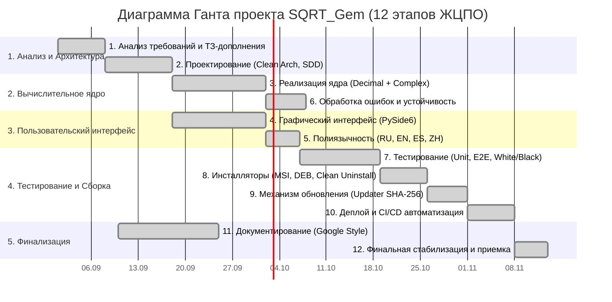
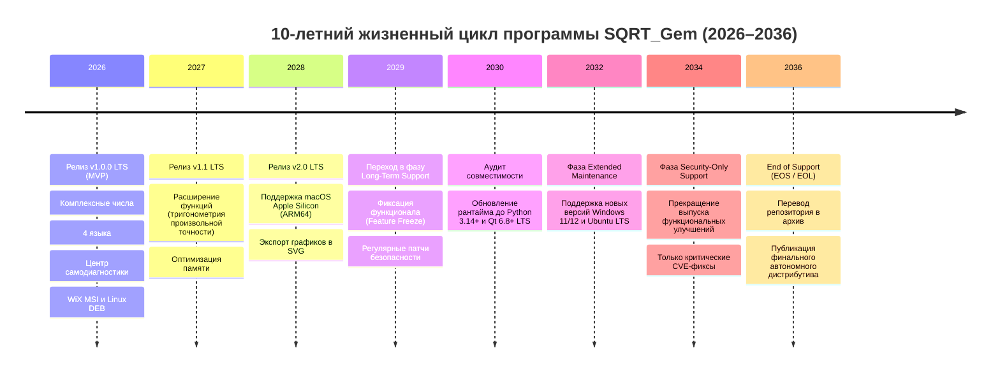

# Дорожная карта и управление временем проекта (Project Roadmap & Gantt Schedule)
## Проект: SQRT_Gem (High-Precision Analytical Math Engine)

> **Document Status:** Approved / Baseline Plan  
> **Engineering Standard:** Google Project Management & Engineering Schedule Style  
> **Methodology:** Hybrid Agile/Scrum (2-Week Sprints) with Critical Path Waterfall Milestones  
> **Lifecycle Horizon:** 10-Year Horizon (2026–2036) to End-of-Support (EOS)  

---

## 1. Календарный план разработки MVP (12 этапов ЖЦПО)

График реализации MVP охватывает 12 обязательных этапов в строгом соответствии с Разделом 21 ТЗ.

---

## 2. Методология соблюдения сроков («Как суметь уложиться в план»)

Для гарантированного соблюдения календарного графика команда применяет систему из 5 инженерно-управленческих практик:

1. **Метод критического пути (Critical Path Method — CPM):**
   - Критический путь проекта: *Анализ → Архитектура ядра → Комплексная арифметика → Интеграция с GUI → Тестирование → Сборка дистрибутивов*.
   - Любая задержка на критическом пути немедленно компенсируется перераспределением ресурсов с некритических задач (локализация, полировка стилей).
2. **Буферизация времени и рисков (20% Time Buffer):**
   - На каждый этап закладывается 20% резерв времени на случай непредвиденных дефектов или изменений в зависимостях ОС.
3. **Двухнедельные спринты и жесткие DoD (Definition of Done):**
   - Задача считается закрытой только при наличии unit/integration тестов с покрытием кода не менее 80% и прохождении линтеров.
4. **Автоматизация через CI/CD как инструмент экономии времени:**
   - Автоматический запуск тестов на GitHub Actions под Windows и Ubuntu освобождает до 35 часов ручной рутины инженера по тестированию на каждом этапе.
5. **Политика «Нулевого технического долга» (Zero Technical Debt):**
   - Ошибки сборки или тестов блокируют любые дальнейшие коммиты в ветку релиза, предотвращая эффект «снежного кома».

---

## 3. 10-летний Roadmap поддержки продукта до EOS (2026–2036)

> В соответствии с требованием ТЗ-дополнения (`TZ_dopolnenie.md`): *«информирование членов команды и пользователей программы о том, что с ней будет происходить до EOS»*.

### 3.1. Детализация фаз жизненного цикла

| Фаза | Период | Статус программы | Регламент обновлений | Обязательства перед пользователями |
|:---|:---:|:---|:---|:---|
| **Phase 1: Active Development** | 2026–2028 | Активная эволюция (v1.0 – v2.0) | Мажорные релизы 1 раз в год, минорные — раз в квартал. | Реализация новых математических функций, доработка UI, расширение языков. |
| **Phase 2: Long-Term Support (LTS)** | 2029–2033 | Стабилизация и совместимость | Полугодовые обновления совместимости с новыми версиями ОС. | Гарантия неизменности математического ядра, сохранение форматов данных `config.json` и `history.json`. |
| **Phase 3: Extended Security Support** | 2034–2035 | Критическое сопровождение | Релизы только при обнаружении уязвимостей безопасности (CVE). | Обеспечение безопасной работы на актуальных ОС без изменения функционала. |
| **Phase 4: End of Support (EOS)** | 2036+ | Завершение поддержки (EOL) | Выпуск финального автономного сборника (Final Gold Archive). | Перевод репозитория в режим Read-Only, снятие обязательств по SLA. |
