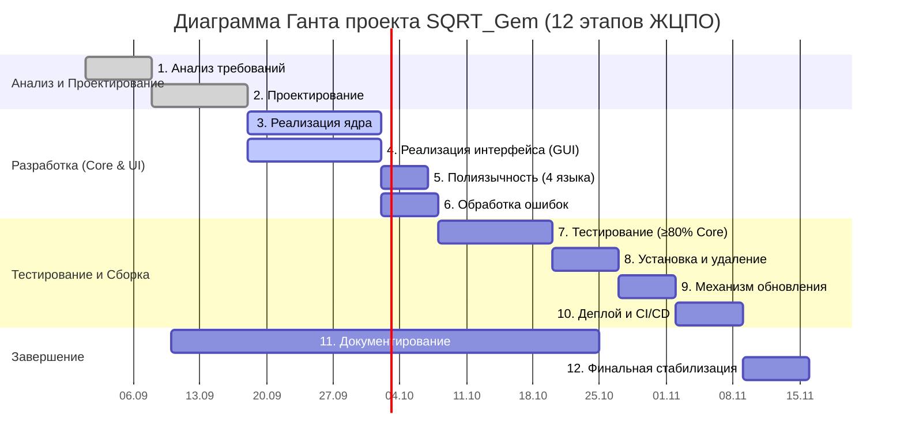
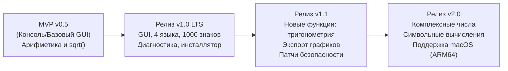

# Дорожная карта и диаграмма Ганта проекта (SQRT_Gem)

> **Статус документа:** Утвержденный календарно-сетевой план  
> **Методология:** Hybrid (Agile/Scrum спринты с фиксированными контрольными точками Waterfall)

---

## 1. Календарный план и диаграмма Ганта (12 этапов)

Диаграмма охватывает все 12 этапов жизненного цикла программного обеспечения, предписанных разделом 21 Технического задания:

---

## 2. Контрольные точки (Milestones)

1. **M1 (Неделя 2):** Утверждение ТЗ, архитектурного документа (ARCHITECTURE.md) и документа проектирования (DESIGN.md).
2. **M2 (Неделя 5):** Вычислительное ядро протестировано на точность до 1000 знаков, покрыто unit-тестами.
3. **M3 (Неделя 7):** Графический интерфейс соединен с ядром, реализовано переключение 4 языков (RU, EN, ES, ZH).
4. **M4 (Неделя 9):** Покрытие тестами критического ядра превышает 80%, реализованы интеграционные и e2e тесты.
5. **M5 (Неделя 11):** Готовы инсталлятор Windows (Inno Setup) с диалогом чистого удаления и скрипты для Linux.
6. **M6 (Неделя 12):** Релиз v1.0 LTS, демонстрация 17 шагов приёмочного сценария.

---

## 3. Дорожная карта развития продукта (Roadmap)

