# План технической поддержки и регламент сопровождения ПО (SQRT_Gem)

> **Статус документа:** Утвержденный регламент сопровождения  
> **Область действия:** Жизненный цикл продукта версий v1.0.0 — v2.x  
> **Целевая аудитория:** Служба технической поддержки (L1/L2/L3), DevOps-инженеры, группа разработки

---

## 1. Общие положения и цели регламента

Настоящий документ регламентирует процессы послерелизного сопровождения программного продукта **SQRT_Gem («Калькулятор высокой точности»)** в соответствии с разделами 12, 13 и 23 Технического задания.

**Ключевые цели регламента:**
- Обеспечение непрерывной работоспособности и высокого уровня удовлетворенности пользователей (CSAT ≥ 95%).
- Строгое соблюдение соглашения об уровне сервиса (SLA).
- Минимизация затрат на сопровождение за счет встроенных механизмов самообслуживания.
- Стандартизация процессов выпуска срочных исправлений (Hotfix) и регулярных обновлений (Minor/Major).

---

## 2. Каналы обращения и график работы

### 2.1. Доступные каналы коммуникации:
1. **Встроенный модуль самодиагностики:** Формирование диагностического пакета (`support_bundle.zip`) в один клик.
2. **Issue Tracker:** Официальный репозиторий проекта на GitHub.
3. **Электронная почта:** `support@sqrt-gem.org`.
4. **База знаний и FAQ:** Встроенная справочная система в приложении.

### 2.2. График работы службы поддержки:
- **L1 / L2 Линии:** Понедельник — Пятница, 09:00 — 18:00 (МСК).
- **L3 (Дежурные инженеры ядра / DevOps):** Круглосуточно (24/7) для критических инцидентов (**P1**).

---

## 3. Матрица классификации инцидентов и регламент SLA

| Приоритет | Категория | Описание инцидента | Время реакции (SLA) | Время Workaround | Время Hotfix/Patch |
| :---: | :--- | :--- | :---: | :---: | :---: |
| **P1** | **Критический (Blocker)** | Полная неработоспособность: аварийное завершение при старте на поддерживаемой ОС, повреждение пользовательских данных. | **≤ 1 час** | **≤ 4 часов** | **≤ 24 часов** |
| **P2** | **Высокий (Critical)** | Критическая функциональность ядра недоступна: ошибка алгоритма вычисления `sqrt()`, отказ механизма переключения языков. | **≤ 4 часов** | **≤ 8 часов** | **≤ 48 часов** |
| **P3** | **Средний (Major)** | Существенная ошибка, имеющая альтернативное решение: сбой экспорта в CSV, артефакт отображения истории. | **≤ 8 раб. часов** | **≤ 24 раб. часов** | Плановый Minor релиз |
| **P4** | **Низкий (Minor)** | Косметические дефекты UI, опечатки в локализации, предложения по улучшению функциональности. | **≤ 24 раб. часов** | По согласованию | Бэклог продукта |

---

## 4. Порядок эскалации и жизненный цикл тикета

```mermaid
flowchart TD
    A([Пользователь]) -->|Обращение + support_bundle.zip| B[L1: Первая линия поддержки]
    B -->|Типовой вопрос / FAQ| C[Решение силами базы знаний]
    C --> Z([Закрытие обращения])
    
    B -->|Сбой ПО / Ошибка| D[L2: Инженеры сопровождения]
    D -->|Известная проблема| E[Предоставление Workaround]
    E --> Z
    
    D -->|Баг ядра или UI| F[L3: Команда разработки Core/DevOps]
    F -->|Инцидент P1 / P2| G[Выпуск экстренного Hotfix]
    F -->|Инцидент P3 / P4| H[Планирование в спринт Minor-релиза]
    G --> I[Верификация QA]
    H --> I
    I --> J[Публикация обновления через Updater]
    J --> Z
```

---

## 5. Регламент выпуска релизов и обновлений

### 5.1. Экстренный релиз (Hotfix: `v1.0.X`)
- **Триггер:** Инциденты приоритета **P1** или массовые **P2**.
- **Процедура:** Создание ветки `hotfix/`, локальный регрессионный тест, сборка через CI/CD, публикация артефакта с типом `critical`.

### 5.2. Плановый минорный релиз (Minor: `v1.X.0`)
- **Периодичность:** 1 раз в 1–2 месяца.
- **Состав:** Накопленные улучшения **P3/P4**, расширение локализации, оптимизация UI.

---

## 6. Стратегия долгосрочной поддержки (LTS)

| Версия | Тип релиза | Окончание активной поддержки | Окончание патчей безопасности (EOL) |
| :---: | :---: | :---: | :---: |
| **v1.0 LTS** | Базовая стабильная версия | 12 месяцев | 18 месяцев |
| **v1.1** | Функциональное обновление | До выхода v1.2 | 6 месяцев |
| **v2.0** | Мажорная версия | 18 месяцев | 24 месяца |
