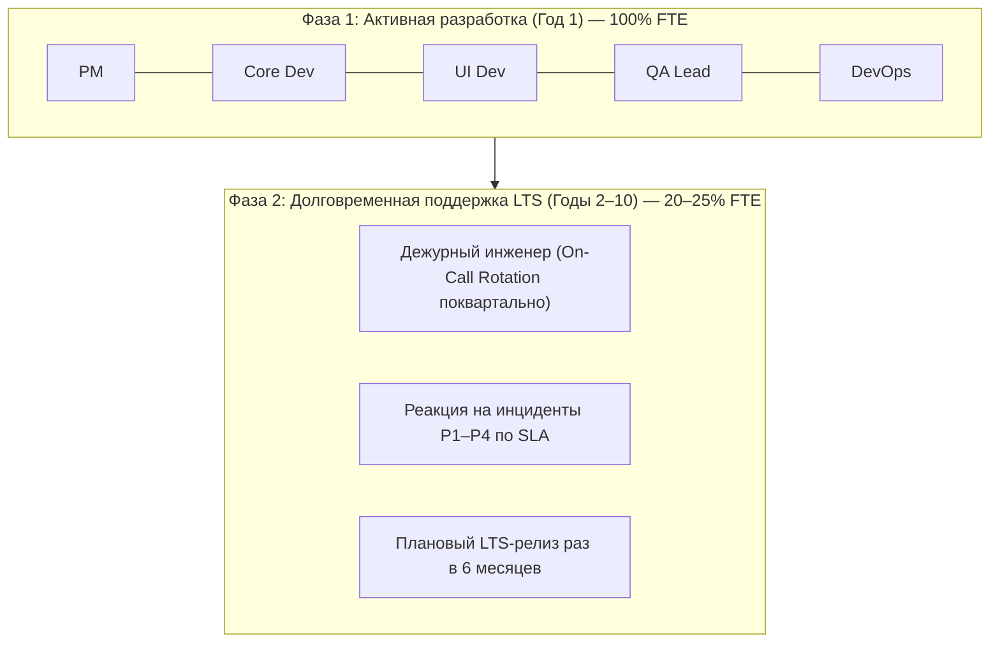

# Структура команды, квалификационные требования и матрица ответственности
## Проект: SQRT_Gem (10-Year Lifecycle Engineering Team)

> **Document Status:** Approved / Operational Guideline  
> **Engineering Standard:** Google Engineering Roles & Responsibilities Framework  
> **Team Headcount:** 5 Engineers (Оптимальный штат для 10-летнего жизненного цикла)  
> **Applicable Requirement:** Пункты 2.1–2.2 ТЗ-дополнения (`TZ_dopolnenie.md`)  

---

## 1. Профиль команды и квалификационные требования на 10 лет

Для устойчивой поддержки MVP в течение 10 лет (2026–2036) до EOS сформирована компактная кросс-функциональная команда из 5 профильных специалистов:

| Роль в проекте | Грейд | Ключевые компетенции и квалификационные требования | Назначение в 10-летнем цикле поддержки |
|:---|:---:|:---|:---|
| **1. Руководитель проекта (Project Manager / Product Owner)** | Senior | Управление проектами по Agile/Scrum/Waterfall, риск-менеджмент, соблюдение SLA, финансово-экономический контроль, ведение Roadmap до EOS. | Контроль релизных циклов, коммуникация с сообществом и корпоративными пользователями, координация инцидентов P1–P4. |
| **2. Ведущий разработчик ядра (Lead Core Math Engineer)** | Senior | Вычислительная математика, численное моделирование, теория грамматик и синтаксического анализа (AST, Shunting-Yard), модуль `decimal`, комплексная арифметика произвольной длины. | Сохранение математической строгости ядра, аудит алгоритмов, оптимизация вычислительной сложности, экспертиза при расследовании сложных дефектов. |
| **3. Разработчик интерфейсов (Senior UI/Qt Engineer)** | Middle+ / Senior | PySide6 / Qt 6, компонентная верстка, многопоточность (`QThread`), система локализации (i18n), юзабилити и доступность (a11y), дизайн-системы. | Адаптация GUI к новым версиям оконных подсистем (Wayland, Windows 11/12 DWM), поддержка масштабирования High-DPI и тем оформления. |
| **4. Инженер по автоматизации тестирования (QA Automation Lead)** | Middle+ | Пирамида тестирования (Unit, Integration, E2E), техники черного и белого ящика (Branch Coverage), pytest, xvfb, регрессионное тестирование алгоритмов. | Поддержание покрытия тестами >90%, валидация математических эталонов при обновлении минорных версий Python, автоматизация приемочного тестирования. |
| **5. Инженер релизов и инфраструктуры (DevOps & SRE / TechWriter)** | Middle+ / Senior | CI/CD (GitHub Actions), упаковка ПО (WiX Toolset v3/v4 MSI, Debian DEB, AppImage), кроссплатформенная сборка, криптография (SHA-256), техническая документация. | Обеспечение воспроизводимости сборок на протяжении 10 лет, поддержка автоматических обновлений, мониторинг безопасности зависимостей (CVE). |

---

## 2. Модель распределения нагрузки и ротации на 10 лет

В фазе активной разработки (Год 1) все 5 участников задействованы на 100% ставки.  
В фазе долговременного сопровождения (Годы 2–10) команда переходит на ротационную схему поддержки:

### 2.1. Правила взаимозаменяемости (Cross-Functionality & Redundancy)
- **Ядро:** При недоступности разработчика ядра задачи анализа алгоритмов принимает QA Lead (имеющий математический бэкграунд) или PM.
- **Интерфейс:** Задачи UI при необходимости решает DevOps-инженер или разработчик ядра (компоненты полностью развязаны через сигналы Qt).
- **Сборка и CI/CD:** Скрипты упаковки (`build_msi.py`, `build_deb.py`) написаны на чистом Python без платформенных зависимостей, что позволяет любому члену команды произвести сборку.

---

## 3. Матрица ответственности (RACI Matrix)

- **R** — Responsible (Исполнитель)
- **A** — Accountable (Ответственный / Утверждающий)
- **C** — Consulted (Консультант)
- **I** — Informed (Информируемый)

| Подсистема / Задача | PM | Core Dev | UI Dev | QA | DevOps |
|:---|:---:|:---:|:---:|:---:|:---:|
| Формирование требований и Roadmap до EOS | **A** | C | C | C | C |
| Архитектура ядра и комплексная арифметика | I | **A / R** | C | C | I |
| Графический интерфейс и локализация (4 языка) | I | C | **A / R** | C | I |
| Автоматизированное тестирование (>90%) | I | C | C | **A / R** | I |
| Нативные пакеты (MSI, DEB) и чистое удаление | I | I | I | C | **A / R** |
| Механизм обновлений с SHA-256 | I | C | C | C | **A / R** |
| Центр самодиагностики и Support Bundle | C | C | **R** | C | **A** |
| Документация по стандарту Google | **A** | C | C | C | **R** |
| Реакция на инциденты P1 в период LTS | **A** | **R** | C | C | **R** |
